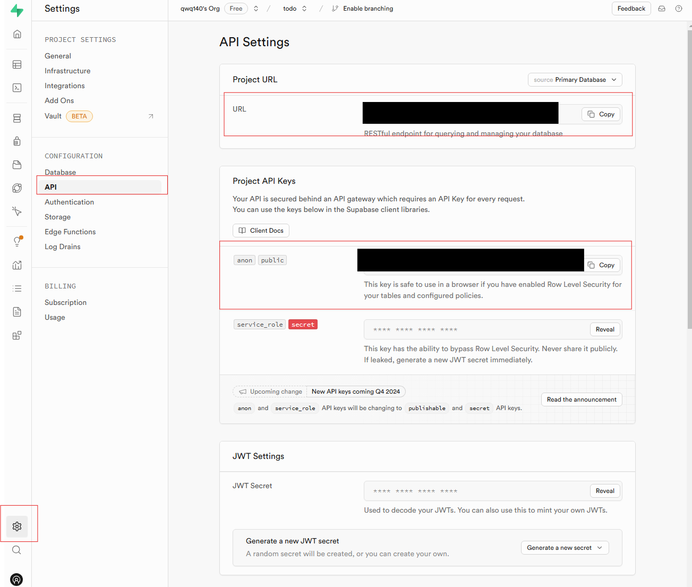

# Flutter Supabase Example
## supabase 세팅하기
### 1. Supabase 회원가입 및 로그인
- https://supabase.com/

### 2. supabase project 세팅

Dashbaord에서 New Project 클릭하여 새 프로젝트 생성하기


프로젝트 이름과 데이터베이스에서 사용할 비밀번호를 입력하고 지역을 선택한다.


테이블 생성하기. 연습용으로 "todo" 테이블 생성

## Flutter 와 supabase 연동하기
https://supabase.com/docs/guides/getting-started/quickstarts/flutter

### supabase 라이브러리 추가
https://pub.dev/packages/supabase_flutter

### supabase 초기화
```dart
void main() async {
  
    await Supabase.initialize(
      url: SUPABASE_URL,
      anonKey: SUPABASE_ANON_KEY,
    );

    runApp(const MyApp());
}
```
URL과 KEY는 Supabase 해당 프로젝트의 setting에서 확인할 수 있다.



### insert
https://supabase.com/docs/reference/dart/insert
```dart
  void onSave() async {
      // ...
      Map<String, dynamic> data = {'content': content};
      
      // ...
        List<Map<String,dynamic>> result = await Supabase.instance.client.from('todo').insert(data).select();
      // ...
  }
```


### update
https://supabase.com/docs/reference/dart/update
```dart
  void updateCompleted(int id, bool completed) async {
    List<Map<String, dynamic>> result = await supabase.from('todo').update({'completed' : completed}).eq('id', id).select();
    TodoModel todoResult = TodoModel.fromJson(result.first);
    setState(() {
      todos = todos.map((e) => e.id == todoResult.id ? todoResult : e,).toList();
    });
  }
```

### delete
https://supabase.com/docs/reference/dart/delete
```dart
  void deleteTodo(int id) async {
    await supabase.from('todo').delete().eq('id', id);
    setState(() {
      todos = todos.where((e) => e.id != id,).toList();
    });
  }
```

### select
https://supabase.com/docs/reference/dart/select
```dart
  void loadTodos() async {
    var response = await supabase.from('todo').select().order('created_at', ascending: false);
    if (response.isNotEmpty) {
      setState(() {
        todos = response
            .map(
              (e) => TodoModel.fromJson(e),
            )
            .toList();
      });
    }
  }
```